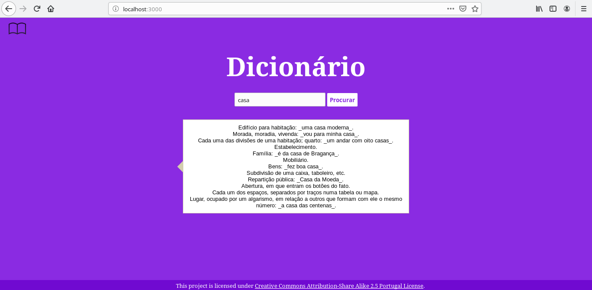
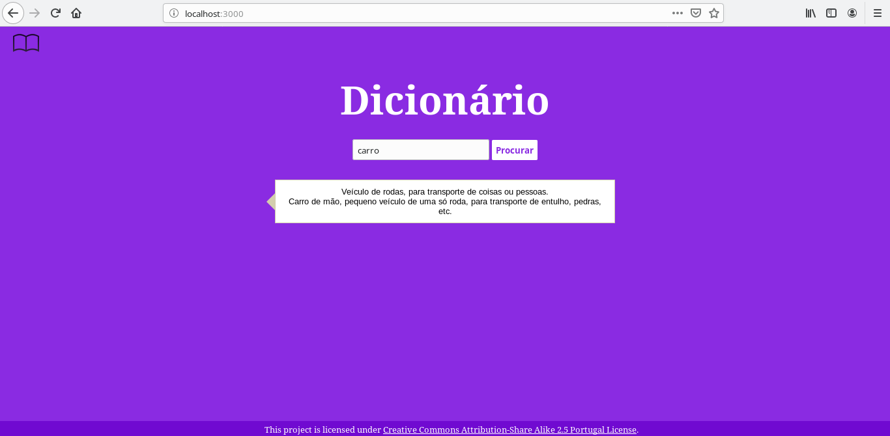

# Dicionário

A beautiful dictionary of the Portuguese language that uses the Open Dictionary [API](http://dicionario-aberto.net/estaticos/api.html).

## Screenshots




## Installation of dependencies

```
$ npm install
```

## Usage

#### Fisrt step:

```
$ npm start
```

#### Second step:

To see the application, open a browser window and navigate to [http://localhost:3000](http://localhost:3000).

## LICENSE

This project is licensed under [Creative Commons Attribution-Share Alike 2.5 Portugal License](http://creativecommons.org/licenses/by-sa/2.5/pt/).
